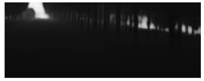

# Image2Depth

## Objective
Depth prediction from monocular images for Autonomous Driving.

## Solution Approach


## Dataset
We have used [Apollo Scenes](http://data.apollo.auto/?locale=en-us&lang=en) dataset and a custom dataset created by us using <b> AirSim Engine by Unity and Microsoft</b> in this project.
<br>
Apollo dataset consists of 23k images.
<br>
Custom dataset created by us consists of 99k images.

## Pre-processing
We clipped the depth image at 80 instead of 165. This is done to focus more on the depth upto 80m as in autonomous driving vision upto 80m is good enough for desicion making. 
<br>
We also removed the upper half of the both rgb and depth image to remove sky from the scene.

## Model Specifications

Model architecture used by us is:-
<p align='center'>
  
</p>

Here, DCNN block mentioned is:-
<p align='center'>
  
</p>


## Some Results
			Input				Ground Truth				Output
<p align='center'>
  
  
  
</p>
<p align='center'>
  
  
  
</p>
<p align='center'>
  
  
  
</p>
<br>
	<br>
<b> Here is the plot of the losses:</b>
<br>
<br>

<p align='float'>
  
</p>
<br>
L1 is absolute mean difference at 1/64th of original resolution
<br>
L2 is absolute mean difference at 1/16th of original resolution
<br>
L3 is absolute mean difference at 1/4th of original resolution
<br>
L4 is  absolute mean difference at original resolution

<br>
	<br>
<b> Here is the mean and standard deviation plot:</b>
<br>
<br>
<p align='float'>
  
</p>
### Some observations


### Postprocessing results
We applied gamma correction on the predicted depth images:

<br>
			Output Image				Output image with gamma correction
<p align='center'>
  
  
</p>

<b> Pseudo color result images </b> <br>
			Ground Truth				Original output				Output with gamma correction
<p align='center'>
  
  
  
</p>

## Requirements
The entire codebase is written in compatibility with tensorflow 2.0. for installing the other
python libraries please use the requiremets.txt file.
```
  $pip install -r requirements.txt
```
This text file contains all the requirements except [cv2 install guide](https://www.pyimagesearch.com/2018/05/28/ubuntu-18-04-how-to-install-opencv/).


## Instructions


## References
